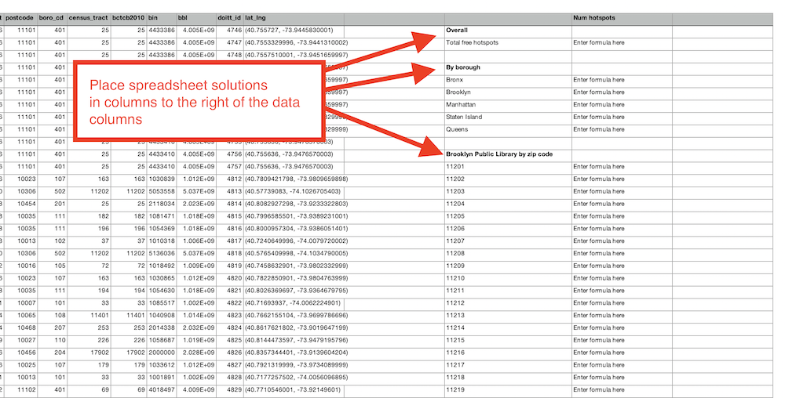

# Exam #1 - Social Network Data Harvesting

An exam covering:

- Plain text data formats (CSV, JSON, XML)
- Data munging in Python
- Spreadsheet data analysis
- SQL programming using SQLite databases
- Data normalization
- Entity-relationship diagrams

## Instructions

There two parts to this exam. Please follow the instructions for each:

1. A [companion Google Form](https://forms.gle/HuJScJGeis7MmUGA9) must be completed and submitted.
1. The instructions below for work to be done within this repository.

## File and directory structure

This repository contains a specific directory/folder structure and specific rules for naming files. Both must be adhered to.

### Directory structure

The purpose of each directory in this repository:

- `data` - must hold all data files. This includes any plain text data files, any spreadsheet files, and any database files.
- `images` - must hold any images file displayed in the documents you will write. Your documents will display these images by using standard Markdown syntax.
- `instructions` - contains instructions for this exam.
- `tests` - contains automated tests that the instructors will use to check basic attributes of your work to make sure it has been done correctly. Do not touch this directory!

### File names

Rules about file names:

- Do not change the names of any existing files.
- The instructions include specific files to create which must be named exactly as indicated.
- Be accurate with capitalization and file extensions.
- File must be placed in the directories indicated. You are not allowed to move any existing files into different directories.

## The data

You are given a data set in the file named [users.csv](../data/users.csv), which contains information a about social network's users.

You are also given a data set in the file named [advertising_rates.csv](../data/advertising_rates.csv), which contains information about the rates charged by the social network for advertisers interested in showing advertisements to the social network's users.

### users.csv

The data in `users.csv` follows the structure indicated in the first few sample lines below, where the first line holds the field headers. See the full data in the file itself.

```csv
id,handle,first_name,last_name,email,street,city,state,gender_identity,real_food_affinity,luxury_brand_affinity,tech_gadget_affinity,travel_affinity,cost_per_impression
1,vwykey0,Valerye,Wykey,vwykey0@ezinearticles.com,6 Surrey Avenue,Dallas,Texas,Male,0.45,0.41,0.75,0.77,10
2,lbrundale1,Lucienne,Brundale,lbrundale1@bloomberg.com,993 New Castle Court,Tacoma,Washington,Genderfluid,0.92,0.45,0.87,0.34,5
3,dbarthot2,Derrik,Barthot,dbarthot2@go.com,87 Grayhawk Road,Washington,District of Columbia,Non-binary,0.28,0.03,0.46,0.09,89
4,shemphrey3,Sigfrid,Hemphrey,shemphrey3@yale.edu,14639 Elka Pass,Sacramento,California,Polygender,0.38,0.1,0.14,0.29,56
5,nzoephel4,Norrie,Zoephel,nzoephel4@imgur.com,9315 Marcy Road,Van Nuys,California,Male,0.08,0.47,0.32,0.78,12
6,eorring5,Erik,Orring,eorring5@etsy.com,02 Brickson Park Terrace,Albany,New York,Agender,0.82,0.36,0.71,0.64,87
```

A few important fields in this data:

- `id` - a unique integer, e.g. 1, 2, 3, etc.
- `handle` - the user's username/handle
- `first_name` - the user's first name
- `last_name` - the user's last name
- `email` - the user's email address
- `street` - the user's street address
- `city` - the user's city of residence
- `state` - the user's state of residence
- `gender_identity` - the user's gender identity, e.g Male, Female, Non-binary, Agender, Genderqueer, etc.
- `real_food_affinity` - how likely the user is to click on an advertisement for "real" food, expressed as a number between 0 and 1.
- `luxury_brand_affinity` - how likely the user is to click on an advertisement for luxury goods, expressed as a number between 0 and 1.
- `tech_gadget_affinity` - how likely the user is to click on an advertisement for tech gadgets, expressed as a number between 0 and 1.
- `travel_affinity` - how likely the user is to click on an advertisement for travel, expressed as a number between 0 and 1.
- `cost_per_impression` - how much the social network charges an advertiser to show one advertisement to the user, measured in US cents.

### advertising_rates.csv

The data in `advertising_rates.csv` follows the structure indicated in the first few sample lines below, where the first line holds the field headers. See the full data in the file itself.

```csv

```

A few important fields in this data:

- `borough` - the name of the NYC Borough within which this neighborhood is located
- `year` - the year in which the population of this neighborhood was counted
- `nta_code` - the code of the neighborhood, following the same codes as the `nta_code` field in the [wifi.csv](#wifi.csv) data set.
- `nta` - the name of the neighborhood
- `population` - the population of this neighborhood

## Data munging

Write a Python program into the file named [solution.py](../solution.py) to open the `users.csv` data file, munge the data according to the instructions below, and save the CSV data to a file named `users_clean.csv` within the `data` directory.

### Munging requirements

In the file named `solution.py`, you will find the several function definitions that lack implementations. Complete each of the function definitions according to the comments within the file. At the end, if done correctly, this program will be able to:

1. open the file named [users.csv](../data/users.csv) within the `data` directory.
1. modify the data in the file, such that...
   - any records with any blank fields are removed
   - any records with `United Kingdom` in the `state` field are removed
   - any records with a `cost_per_impression` over $1 are removed
   - any `email` address ending with `@dmoz.org` has this domain name replaced with `@dmoz.com` instead.
1. save the modified data to a file named [users_clean.csv](../data/users_clean.csv), also within the `data` directory.
1. open [users_clean.csv](../data/users_clean.csv) and output the average `cost_per_impression` of all the records in the cleaned data file.

Rules and regulations:

- You **must** write the code of this Python program according to the instructions written as comments within the program file.
- You **must** use the `csv` module's `DictReader` feature to parse this data.
- You **must** convert the data in this `DictReader` to a regular Python list (in this case the list will contain a Dictionary for every row in the file)
- You **must not** use `pandas` or any other data parsing or analysis module.
- You **must not** modify the original data file - save the changes into the new data file.

## Spreadsheets

In the file named [wifi.xlsx](../data/wifi.xlsx) within the `data` directory, you will find the original data (not the cleaned version) has been imported for you into a spreadsheet file. Complete the tasks below within this file in the designated cells.

**Note**: All major spreadsheet applications can import and export in Microsoft Excel's `.xlsx` file format. You are welcome to use any spreadsheet application of your choice. but your work must be saved in the `wifi.xlsx` file within the `data` directory in Microsoft Excel format with the formulas used to calculate results intact and working.

### Spreadsheet analysis requirements

Perform the following calculations using **singular formulas** within the spreadsheet in the clearly labeled cells given to you **at the top-right of the spreadsheet worksheet**, to the right of all the columns with the raw data in them.



Each formula **must also be entered into the [README.md](../README.md) file** in the designated space.

1. Total number of free Wi-Fi hotspots in NYC
1. Number of free Wi-Fi hotspots in each of the 5 boroughs of NYC. (You are forbidden from hard-coding the names of the boroughs into the formula you use. Rather, the formula should refer to the neighboring cells where the borough names are written.)
1. Number of free Wi-Fi hotspots provided by the Brooklyn Public Library in each of the zip codes of Brooklyn. (You are forbidden from hard-coding the zip codes into the formula you use. Rather, the formula should refer to the neighboring cells where the zip codes are written.)
1. The percent of all hotspots in Brooklyn that are provided by the Brooklyn Public Library. (You are forbidden from hard-coding any sum or count values into the formula you use. Rather, these should be dynamically calculated within the formula using functions.)

Be sure to save your work.

## SQL

### Setup

You have been given an empty SQLite database named `data.db` within the `data` directory.

### SQL requirements

Write singular SQL commands that perform the following tasks.

Each SQL command **must also be entered into the [README.md](../README.md) file** in the designated space.

1. Write two SQL commands to create two tables named `hotspots` and `populations` within the given database file that can accommodate the data in the `wifi.csv` and `neighborhood_populations.csv` CSV data files, respectively. Use data types and primary key fields that make sense for the data.
1. Import the data in the `wifi.csv` and `neighborhood_populations.csv` CSV files into these two tables. (You may use more than one command to achieve each of these imports, if necessary.)
1. Display the five zip codes with the most Wi-Fi hotspots and the number of Wi-Fi-hotspots in each in descending order of the number of Wi-Fi-hotspots.
1. Display a list of the name, address, and zip code for all of the free Wi-Fi locations provided by `Transit Wireless` in Manhattan, in ascending order of zip code.
1. Display the names of each of the boroughs of NYC, and the number of free Wi-Fi hotspots in each.
1. Display the number of wifi hotspots in Fort Greene, Brooklyn along with the population of Fort Greene, Brooklyn.
1. Display the number of wifi hotspots in each of the 5 NYC boroughs, along with the population of each borough.
1. Display the names of each of the neighborhoods in which there exist Wi-Fi hotspots, but for which we do not have population data.
1. Write an additional SQL query of your choice using MySQL with this table; then describe the results
   - e.g. "This query identifies all of the Wi-Fi-hotspots in the zip codes where I live and where I go to school and gives me the name and address to find them."

## Data normalization & entity-relationship diagramming

Answer the following questions, and enter your responses into the `README.md` file in the designated spots.

1. Is the data in `wifi.csv` in fourth normal form? Answer based only on those fields described in the [discussion of the data](#the-data) above. Ignore the others.
1. Explain why or why not the `wifi.csv` data meets 4NF.
1. Is the data in `neighborhood_populations.csv` in fourth normal form? Again, answer based only on those fields described in the discussion of the data above. Ignore the others.
1. Explain why or why not the `neighborhood_populations.csv` data meets 4NF.
1. Use [draw.io](https://draw.io) to draw an Entity-Relationship Diagram showing a 4NF-compliant form of this data, including primary key field(s), relationship(s), and cardinality. Again, focus on and diagram only the attributes described in the discussion of data above. Ignore the others. Export the diagram as an `.svg` file into the `images` directory.
